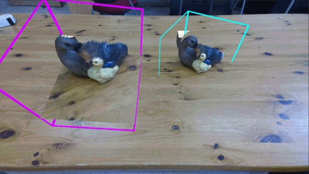
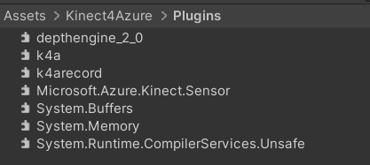

# Duplicated Reality

This project contains a minimal working example of Duplicated Reality.

The concept of Duplicated Reality is to show a duplicated real-time representation of the real world in Augmented Reality.
A 3D space, defined by a region of interest, can then be moved around and scaled dynamically.
Refer to our publication to see how we applied this concept to co-located mixed-reality collaboration.

Real-time Duplication of Point cloud
<p align="center">
  
</p>

Dynamic Interactions
<p align="center">
  
</p>

Scaling Up and down
<p align="center">
  
</p>

## Requirements
- Kinect4Azure Camera
- Tested with Unity 2022.3.5f1

## Project Setup
Copy .dll of the Kinect4Azure SDK into "Assets/Kinect4Azure/Plugins" folder. Related repositories such as by [rfilkov](https://github.com/rfilkov/AzureKinectUnityFree/tree/master/Assets/AzureKinectExamples/SDK/Kinect4AzureSDK/Plugins).

This is how it should look like in Unity's Project Directory:
<p align="left">
  
</p>

## Running the Example
An example scene is located at "Assets/Example/DuplicatedReality_SampleScene.unity".\
The images above are acquired with this sample scene.
________________________________________________________________________________________________________________
Cite us!

```
@article{yu2022duplicated,
  title={Duplicated Reality for Co-located Augmented Reality Collaboration},
  author={Yu, Kevin and Eck, Ulrich and Pankratz, Frieder and Lazarovici, Marc and Wilhelm, Dirk and Navab, Nassir},
  journal={IEEE Transactions on Visualization \& Computer Graphics},
  number={01},
  pages={1--1},
  year={2022},
  publisher={IEEE Computer Society}
}

